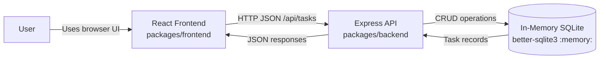
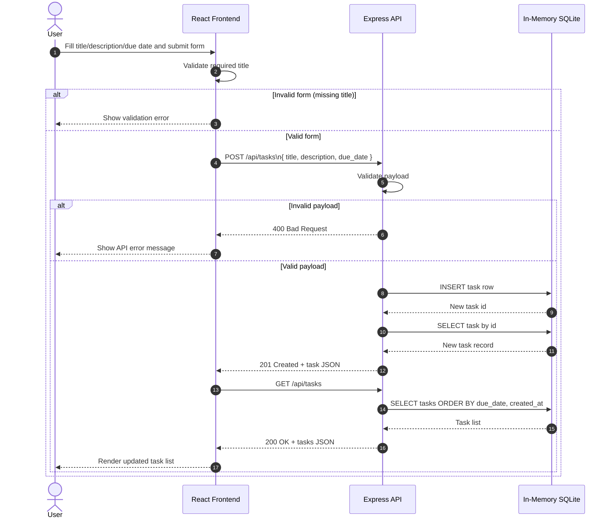

# Cloud Architecture Overview

This document describes the high-level architecture for the TODO app monorepo.

## System Context Diagram

```mermaid
flowchart LR
    U[User]
    FE[React Frontend\npackages/frontend]
    API[Express API\npackages/backend]
    DB[(In-Memory SQLite\nbetter-sqlite3 :memory:)]

    U -->|Uses browser UI| FE
    FE -->|HTTP JSON /api/tasks| API
    API -->|CRUD operations| DB
    DB -->|Task records| API
    API -->|JSON responses| FE
```

## Sequence Diagram: User Creating a TODO

```mermaid
sequenceDiagram
    autonumber
    actor User
    participant FE as React Frontend
    participant API as Express API
    participant DB as In-Memory SQLite

    User->>FE: Fill title/description/due date and submit form
    FE->>FE: Validate required title

    alt Invalid form (missing title)
        FE-->>User: Show validation error
    else Valid form
        FE->>API: POST /api/tasks\n{ title, description, due_date }
        API->>API: Validate payload

        alt Invalid payload
            API-->>FE: 400 Bad Request
            FE-->>User: Show API error message
        else Valid payload
            API->>DB: INSERT task row
            DB-->>API: New task id
            API->>DB: SELECT task by id
            DB-->>API: New task record
            API-->>FE: 201 Created + task JSON
            FE->>API: GET /api/tasks
            API->>DB: SELECT tasks ORDER BY due_date, created_at
            DB-->>API: Task list
            API-->>FE: 200 OK + tasks JSON
            FE-->>User: Render updated task list
        end
    end
```
